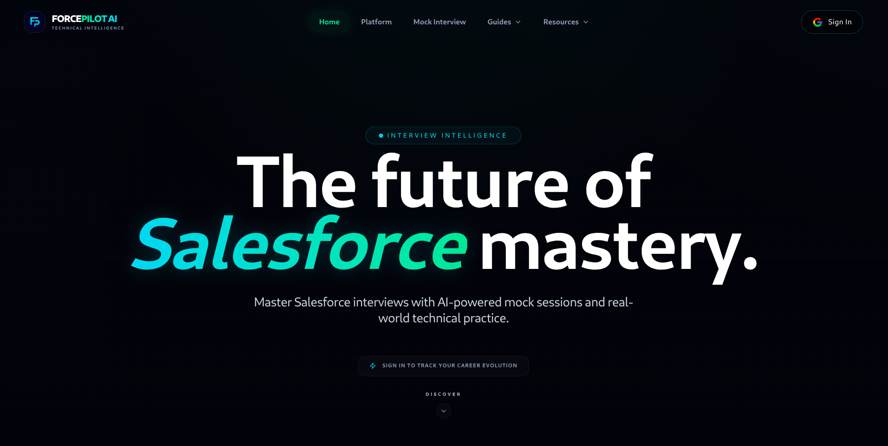
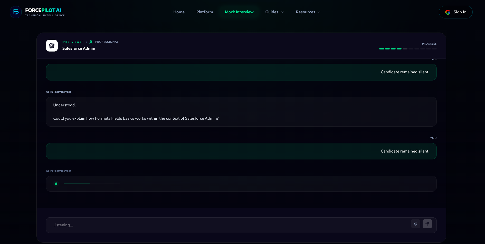
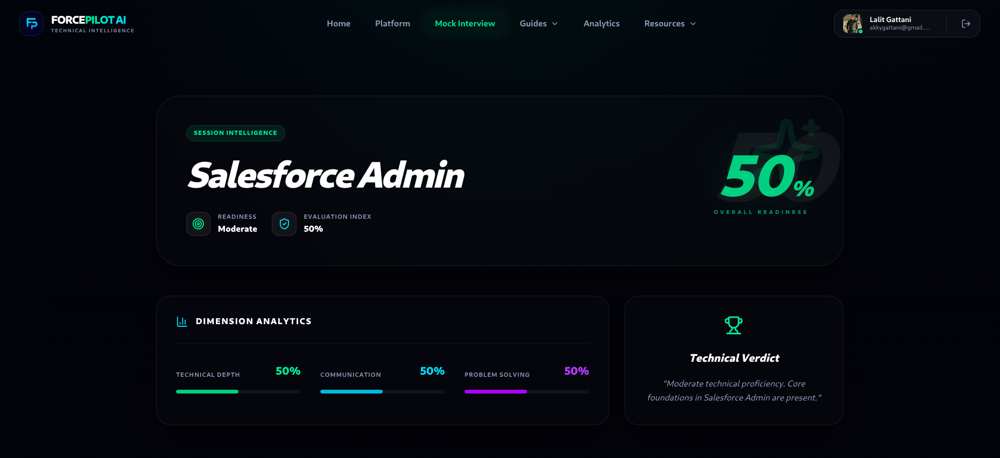

# ForcePilot AI

AI-powered Salesforce Interview Intelligence Platform.

ForcePilot AI helps Salesforce professionals practice realistic AI interviews with instant recruiter-style feedback, scoring, and performance analysis.

## Live Demo

https://www.forcepilotai.online/

---

## Features

- AI-powered mock interviews
- Salesforce-focused interview questions
- Real-time response analysis
- Smart scoring system
- Mobile responsive UI
- PWA support
- Modern dark UI
- Recruiter-style feedback

---

## Tech Stack

### Frontend
- React
- TypeScript
- Vite
- Tailwind CSS

### Backend
- Node.js
- Express.js

### AI
- Groq AI

---

## Screenshots

### Homepage



### Interview Experience



### AI Feedback System




---

## Installation

```bash
git clone https://github.com/lalitgattani11/ForcePilot-AI.git

cd ForcePilot-AI

npm install

npm run dev
```

---

## Project Structure

```txt
src/
backend/
public/
```

---

## Author

Lalit Gattani
